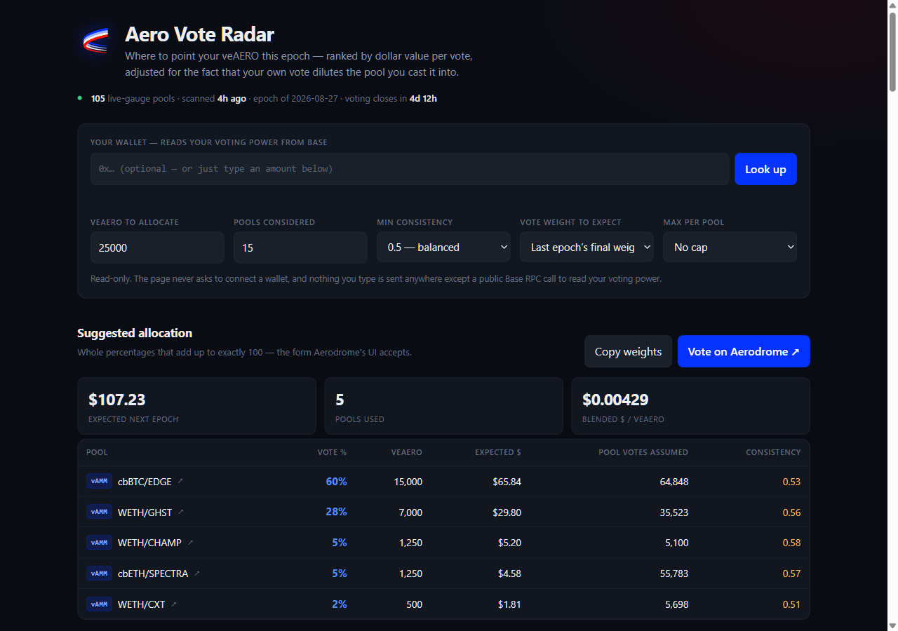

# aero-vote-radar

### You hold veAERO. Where does this week's vote go?

> **Coming change:** Aerodrome becomes Aero on **October 22, 2026, 00:00 UTC**, with a new rewards system (sAERO and Predictive Allocation). See [Aero's announcement](https://aero.xyz/articles/aero-launch-update-all-systems-go/). How veAERO carries over has not been published yet; this tool covers the current weekly veAERO vote.

Type your balance into **[aero.deftools.xyz](https://aero.deftools.xyz)** and get back whole percentages you can paste straight into Aerodrome's voting UI — ranked by what each pool really pays per vote, and priced *after* your own vote dilutes it.

[](https://github.com/araxis33/aero-vote-radar/actions/workflows/ci.yml)
[](https://aero.deftools.xyz)
[](https://www.npmjs.com/package/aero-vote-radar)
[](LICENSE)

[](https://aero.deftools.xyz)

### What it does for you

The page opens on one question -- how much veAERO you have -- with the four
expert controls folded behind *Settings* on defaults that work, and it prices
the suggestion against **the weight each pool usually settles at** rather than
the weight showing at this moment. That last choice is why there is no longer a
paragraph under the allocation explaining that the dollars above are about to
fall: they are already the post-refill ones. Replaying past epochs, the three
bases earn within a few percent of each other with no consistent winner
(measured 2026-09-15, see below), so among equals the page now shows the figure
it does not have to disclaim.

- **Hands you a castable vote, not a leaderboard.** Whole percentages summing to exactly 100 — the only form Aerodrome's UI accepts — with a copy button and a link straight to the voting page.
- **Prices your own dilution.** The moment you add votes to a pool, your own $/vote there falls. The allocator models that explicitly instead of dumping everything into whatever shows the highest APR.
- **Tells you how much of itself to believe.** Of the ten pools a list like this puts on top, roughly six were still on top when the epoch closed — and only two once near-empty gauges are counted in. Measured, from the scan history, and printed on the page above the ranking rather than left as a warning that the numbers "move".
- **Tells you when it expires.** A vote only counts toward the epoch it is cast in, so every recommendation carries the deadline and a countdown running off your own clock.
- **Flags the traps rather than ranking them.** A single one-off bribe five weeks ago, a pool whose vote weight gets refilled in the last hours of the epoch, a pool too new to have a record — each is marked, because each looks like an opportunity and isn't.
- **Never touches your wallet.** No connection request, no signature, no keys. It prints numbers; you cast the vote. Reading voting power from an address is a read-only chain call.

### Three ways to run it

| | |
|---|---|
| **Hosted page** | **[aero.deftools.xyz](https://aero.deftools.xyz)** — nothing to install. A scheduled job re-scans the chain every 6 hours; the allocation itself runs in your browser. |
| **CLI** | `npx aero-vote-radar recommend --veaero 25000 --vote-ready` — a live scan off Base mainnet, nothing to clone. No API keys, no backend, no database. |
| **MCP server** | `npx aero-vote-radar-mcp` — five tools for Claude or any MCP-capable agent: *"recommend an allocation for my 25,000 veAERO."* |

Everything below is the long version: why the obvious strategy loses money, what each number
means, and — at least as important — what this tool cannot tell you.

## Why

Aerodrome pools receive weekly bribes + trading fees, split pro-rata among everyone who voted for that pool with their veAERO. Four things make "just vote for the highest-APR pool" a bad strategy:

1. **Self-dilution.** The moment you add votes to a pool, you've changed its vote total, and your own share (and everyone else's) goes down. A pool that looks great before your vote can look mediocre after it, especially if you have a large veAERO balance relative to the pool's existing votes.
2. **The vote weight you divide by is not final.** Votes carry over between epochs on Aerodrome, so a pool's mid-week weight is largely inherited from last week and gets rewritten as holders re-vote — and they re-vote late. Measured against this repo's own six-hourly snapshot history, roughly **29-30% of all vote weight across the protocol is added or removed in the final five hours before an epoch closes**. A per-vote figure computed against the current weight is therefore a figure computed against a denominator that has not settled.

3. **Lag.** The leaderboard everyone looks at is *last epoch's* result. Pools where incentives are trending up faster than votes have caught up are where the actual opportunity is — by the time it's obvious, the vote weight has already caught up too.

4. **One-off bribes masquerading as opportunities.** A pool that got a single $600 bribe five weeks ago and nothing since has the same trailing average as one that pays $100 like clockwork — but voting into the first is a bet that a one-week event repeats.

`aero-vote-radar` addresses all four: it ranks pools on a trailing average capped at the last completed epoch — so neither a one-week spike nor a pool whose incentives have dried up is priced on weeks that are gone — scores how *steady* each pool's incentives have actually been, judges every pool against the vote weight it *usually settles at* rather than the one it happens to be showing, and allocates using a greedy marginal-value algorithm that models dilution explicitly. It also ships a `backtest` command that replays past epochs so the claim "this beats naive APR-chasing" can be checked rather than taken on faith.

## How it works

Every number comes from Aerodrome's own official on-chain "Sugar" contracts and the `Voter` contract, read live off Base mainnet, plus [DefiLlama](https://defillama.com)'s free price API to convert bribe and fee tokens to USD. No API keys, no backend, no database.

| Data | Source | Contract (Base mainnet) |
|---|---|---|
| Which pools can receive votes, which gauges are alive | `Voter` | `0x16613524e02ad97eDfeF371bC883F2F5d6C480A5` |
| Pool token/symbol metadata | the pool contracts themselves (ERC20-like) | (per-pool) |
| Weekly epoch history — votes, bribes, fees | `RewardsSugar` | `0x1b121EfDaF4ABb8785a315C51D29BCE0552A7678` |
| Your veAERO locks & voting power | `VotingEscrow` | `0xeBf418Fe2512e7E6bd9b87a8F0f294aCDC67e6B4` |
| USD pricing for bribe/fee tokens | [DefiLlama](https://defillama.com) `coins.llama.fi` (free, keyless) | — |

All addresses are pulled from Aerodrome/Velodrome's own [official Sugar deployment file](https://github.com/velodrome-finance/sugar/blob/master/deployments/base.env) and cross-checked against verified contract names on Basescan.

Two things worth calling out honestly, so the tool isn't oversold:

- **"Predicted" is a capped trailing average, not machine learning.** `predictedValuePerVote` = min(mean of the last 6 epochs' USD value, what the last completed epoch paid) ÷ current votes. The cap was added on 2026-09-26: the plain average kept a pool that had fallen from $480 to $9 a week priced at ~$200 and put half the suggested vote into it. Replayed over 19 weeks of live history, the capped forecast earned 59–86% more than the plain average at 10k–1M veAERO, and its promised total came within 1.4× of what was realised instead of 4–11×. It's a simple, transparent heuristic, not a forecast model.
- **The best allocation is often one pool at 100%, and `--max-weight` is there for when that is more concentration than you want.** On live data, 25,000 veAERO uncapped goes entirely into a single pool for an expected $352.81; capped at 25% it spreads over nine pools for $212.04. The cap is not free and the tool does not pretend otherwise — it is a risk preference, priced. A cap too tight for the pools that qualified (three pools capped at 20% can hold 60% of a budget) makes the CLI, the MCP tool and the web page refuse rather than print a vote: the rounding step normalises whatever it is handed back to 100%, so a part-spent allocation would silently hand back the concentration the cap was set to avoid.
- **A recommendation expires.** A vote only counts toward the epoch it is cast in, so `recommend` now closes with how long that epoch has left and the exact UTC instant it flips, and the web page carries the same countdown (recomputed from the visitor's own clock, not from the up-to-six-hours-old snapshot). The snapshot JSON publishes `epochEndsAt` for anything else reading it. The boundary belongs to the epoch opening there, so a vote cast at the instant of the flip has a full week, not zero seconds.
- **The allocator allocates in whole percentage points, because that is what a vote is.** Aerodrome's UI takes whole percentages, so the budget is handed out in 100 steps of one castable point each. This is not a resolution setting turned down: finer steps produce fractions of a point that can only be rounded away afterwards, and on a 1,000,000 veAERO run that meant nine of fifteen recommended pools landed under 0.5% and vanished, leaving a table whose expected total no real vote could earn. Quantising costs nothing in return — each pool's `R*x/(V+x)` is concave, and for a sum of concave functions, giving each identical indivisible unit to the best marginal is exactly optimal on that lattice. The consequence you can check: the quoted total and the vote-ready total are now the same number.
- **The allocator assumes other voters' votes stay put.** The greedy marginal algorithm optimizes your allocation against the *current snapshot* of everyone else's votes. It doesn't (and can't) predict how other voters will react to your vote.
- **The headline per-vote figure divides by a weight that has not settled, so there is a second one beside it.** `predictedValuePerVote` is `trailingAvgUsd / currentVotes`: a six-epoch average numerator over the live mid-week vote tally. Votes carry over between epochs, so that tally is last week's weight part-way through being rewritten — it has shed the holders who already moved on and not yet gained the ones who vote late. `dilutionAdjustedValuePerVote` instead divides by the weight the pool **settled at last epoch**, and that is what the allocator prices against. Both are always published, so the gap is visible rather than quietly applied.

  **The basis was chosen by measurement, not by argument, after an earlier one picked by argument turned out to be worse than doing nothing.** Using this repo's own six-hourly snapshot history, every scan taken inside a since-settled epoch is a real mid-week vantage point; scoring each candidate predictor against the weight that epoch actually settled at (5,142 observations over two epochs, log-scale error since payout depends on weight multiplicatively):

  | predictor | median error | bias | closest on |
  |---|---|---|---|
  | last epoch's settled weight (default) | **17%** | none | 2,728 |
  | the live mid-week tally (`--vote-basis current`) | 18% | none | 1,568 |
  | larger of tally and typical weight (`--vote-basis typical`) | 26% | **+4% high** | 846 |

  The third was the default for a few hours and is kept only so the finding stays reproducible. It took `Math.max` of the live tally and the pool's median past weight, on the reasoning that a pool below its usual weight will be refilled and so the larger figure "cannot be wrong in the voter's favour". `Math.max` is one-sided: it can only raise an estimate, so an upward bias is built in by construction, and an estimator's bias is not a safety margin — it is an error the allocator then spreads over every pool it prices. On pools under 10k votes, where it was supposed to help most, it was worst by a wide margin (71% error against 35% and 29%).

  **Two limits worth stating.** Only two settled epochs have snapshot coverage (the history starts 2026-08-07), and the observations within a pool are not independent, so call it a few hundred independent points rather than five thousand — the effect size is large and consistent across every pool-size bucket, which is why it is trusted, but it is not a long record. And `backtest` **cannot** settle this question: replaying a closed epoch has no mid-week tally to work from, so the previous settled weight stands in for both bases and they become the same number there. Separating them needs a mid-week vantage point, which only the snapshot history provides.

  **This table has already moved, and moved enough to flip the ranking.** The table above is the measurement from when this section was written; the same measurement, refreshed weekly against a growing history, is committed to [`docs/data/timing.json`](docs/data/timing.json)'s `accuracy` field. As of the copy committed there on 2026-09-10 (13,048 observations over 5 settled epochs), `current` has the lower median error, not `previous` — see "Checking the vote basis yourself" below for the numbers and what they do and don't mean.

- **`consistency` is a description of the past, not a promise about the future.** It's `1 / (1 + coefficient of variation)` over the observed epochs: 1.00 means the pool paid the same every epoch, lower means spikier. A pool with only one observed epoch scores 0 rather than 1 — a single data point can't demonstrate steadiness, and scoring it as perfect would flatter brand-new pools exactly where the tool should be most cautious. Use `epochsObserved` to tell "unproven" apart from "genuinely erratic".
- **`momentum` compares halves of the history, and ignores the epoch in progress.** It's the recent finished epochs' average over the older ones', minus 1 — enough to separate a pool ramping from $50 to $500 from one decaying $500 to $50, which `trailingAvgUsd` and `consistency` both score identically. Two details keep it honest: `RewardsSugar` returns the *current* epoch at index 0, so a mid-week scan sees a part-week that would make every pool look like it was fading — that entry is charted but excluded from the comparison (`currentEpochPartial` says which snapshots have one). And the older half has to clear the same `MIN_TRAILING_USD` floor the rankings use, because a ratio explodes when its denominator is loose change: on live data, an unguarded version topped the "ramping up" list with a pool going from $0.02 to $5.75 an epoch (+29,286%), ahead of one genuinely going from $54 to $417. Only the *older* half is floored — a pool collapsing from $200 an epoch to $12 has a small recent half, and that is the finding. Four finished epochs are the minimum; below that it's `null`.
- **The backtest is a small sample with survivorship bias.** It only sees pools whose gauge is still alive today, and it assumes your votes wouldn't have changed anyone else's behaviour. Treat a handful of epochs as a sanity check, not a track record.
- **`recommend` and `backtest` both default to `--min-consistency 0.5`, the same as the hosted page** (since 2026-09-25). Before that the CLI defaulted to no filter, and on the 2026-09-25 scan it put 100% of 10,000 veAERO into a single pool whose vote weight had dropped to a twentieth of its usual for one week. Replaying 8 epochs, the filtered default earned more at every size tested: +43% at 10,000 veAERO, +19% at 25,000, +15% at 100,000. `pools` still lists everything. **If you vote with a different filter, pass the same one to `backtest`** — otherwise the report scores the default strategy and quietly credits it to yours. The filter is re-derived for each tested epoch from that epoch's own trailing window, never from today's history, so it cannot smuggle the outcome into the decision. The naive baseline stays unfiltered on purpose: a baseline that inherits the radar's judgement is no longer a baseline, and its uplift would not be comparable with an unfiltered run. `candidatesExcludedByConsistency` reports what the filter cost you in choice.
- **Concentrated-liquidity (Slipstream) pools are ranked too, and until 2026-09-15 they were not.**
  They have no `symbol()` of their own, and pool discovery required one, so every
  single one was dropped in silence. The scan returned 107 pools where 359 exist,
  and put the whole protocol's incentives for the epoch of 2026-09-03 at $121,034
  against an actual **$2,131,626** — 5.7% of the money and 9.6% of the vote weight.
  They are now named from the pair they hold (`CL-WETH/cbBTC`), which is enough:
  everything downstream keys on the address. Seven of the top eight pools by
  predicted $/vote are ones the ranking could not previously see.
- **`Voter.pools()` currently lists ~1,830 pools that have ever had a gauge; only ~96–108 pass a minimum trailing-value floor** (pools below ~$10/epoch trailing value are excluded — at that size a single small one-off bribe swings the "edge" percentage wildly without being a meaningful signal). That range is measured, not guessed: every scheduled scan's `poolCount` is committed to [`docs/data/snapshot.json`](docs/data/snapshot.json), and it has held in that band across every scan in the project's history so far (109 scans spanning 28+ days as of this writing) — check `git log -- docs/data/snapshot.json` for the current count, since this range moves as the history grows. A few hundred Voter-registered entries fail basic ERC20 calls (non-standard/likely cross-chain relay entries) and are skipped with a warning rather than failing the whole run.

## Web app

[aero.deftools.xyz](https://aero.deftools.xyz) is the same ranking and the same allocator, without installing anything.

It exists because the two halves of this tool have very different costs. The **scan** is heavy — one epoch-history call per live-gauge pool, several hundred of them — which a visitor's browser cannot do against a public RPC without being rate-limited into uselessness. The **allocation** is just arithmetic over an already-scanned list, and is instant.

So they're split:

- A scheduled job (`.github/workflows/snapshot.yml`, every 6 hours) runs `npm run snapshot`, which performs the full live scan and writes [`docs/data/snapshot.json`](docs/data/snapshot.json). If the file changed, the job commits it. A scan that returns zero pools throws instead of publishing, so a rate-limited run can't blank out yesterday's perfectly good data.
- [`docs/index.html`](docs/index.html) fetches that JSON and runs `allocateAcrossCandidates` + `toWholePercentWeights` — ported verbatim from `src/allocator.ts` — in the browser, per keystroke.

Nothing is sent anywhere: the page is a static file plus a JSON file, with no backend and no analytics. Because the personalised half runs client-side, changing your veAERO amount doesn't trigger a re-scan, and the snapshot can be shared by every visitor.

The page also:

- **Reads your voting power from an address.** Paste a wallet and it sums your locks' live voting power. This is read-only — the page never requests a wallet connection or a signature.
- **Charts each pool's epoch history and which way it's moving.** Every row in the full ranking carries a six-epoch bar chart and a trend figure, and a *Which way incentives are moving* panel lists the five pools ramping hardest and the five fading hardest. The bar for the epoch still running is drawn as a dashed outline rather than a solid bar, because it is a part-week: showing it solid would draw a cliff on every pool in the table. Each pool is scaled to its own maximum — the column answers "which way is this pool going", not "is it bigger than that one", which the dollar columns beside it already answer.
- **Shows how far each pool's live weight sits from its usual one.** A *Refill* column carries that ratio, and the *Vote weight to expect* control switches the ranking and the suggested allocation between last epoch's settled weight (the default) and the live tally. The Refill figure is a warning worth reading — a pool whose weight swings by an order of magnitude between epochs is a different proposition from a steady one — but it deliberately no longer drives the denominator: see the measurement above for why letting it do so made the tool worse.
- **Shows what the whole pot is paying.** A protocol-wide table of every pool's incentives over every pool's votes, epoch by epoch. The per-pool ranking is about choosing *between* pools and looks identical whether the pot it divides is growing or collapsing — and across the five finished epochs in the snapshot this was written against, a veAERO vote went from $0.00100 to $0.00066. Reward tokens are valued at today's prices even for older epochs and only pools with a live gauge today are counted, which both push the older figures down, so a decline shown there is a floor on the real one.
- **Copies the weights** as `93%  sAMM-WETH/msETH` lines, so they can go straight into Aerodrome's UI instead of being retyped from the screen.
- **Labels each pool `vAMM` or `sAMM`** — volatile (`x·y=k`, for tokens whose prices move independently) versus stable (a flatter curve for pairs meant to hold the same value). Each row links to the pool contract on Basescan.

**Why this reads `VotingEscrow` directly instead of `VeSugar.byAccount`:** that method returns one large struct per lock, including every vote each lock has cast, and on a public RPC it **reverts** for wallets holding many locks — `0xbde0…ea5a`, with 22 locks, fails outright. Both the web page and the CLI's `--address`/`my-veaero` instead make three plain calls against the `VotingEscrow` contract (`balanceOf` → `ownerToNFTokenIdList` → `balanceOfNFT`), all of which return single integers. Verified equal to the VeSugar path where VeSugar works (`0xde86…ee31`: both report `81.50845401781879`), and working on the 22-lock wallet where it doesn't. The contract address is read from `Voter.ve()` rather than copied from documentation. Note that voting power decays continuously toward a lock's expiry, so two reads seconds apart legitimately differ.

The site is served by GitHub Pages from the `docs/` folder on `main`. To regenerate the snapshot by hand:

```bash
npm run snapshot                      # writes docs/data/snapshot.json
npm run snapshot -- some/other.json   # or somewhere else
```

**Verified parity:** for 25,000 veAERO with no consistency filter, the page and `npm run cli -- recommend --veaero 25000 --vote-ready` produce the same weights (76/20/2/1/1) and the same expected total, to the cent.

## Checking the vote basis yourself

```bash
npm run predict-check                 # walks the committed snapshot history
npm run predict-check some/dir        # or a directory of snapshot JSON files
```

This is the measurement that decides `--vote-basis`, kept as a command rather
than as a number in this README, because the reason the tool once shipped the
wrong default was that measuring it looked like an afternoon's work. It is one
command.

It works by exploiting something the backtest cannot reach. Replaying a closed
epoch offers no mid-week vote tally, so `previous` and `current` become the same
number there and the backtest is blind to the difference. But every scan ever
committed to `docs/data/snapshot.json` recorded the live tally at that moment,
six-hourly — so a scan taken inside an epoch that has since settled **is** a real
mid-week vantage point with the answer now known. Each basis is scored against
what those epochs actually settled at, with the trailing window it would have
had at the time, and the same `MIN_TRAILING_USD` gate the rankings use, so the
result describes the pools the tool would really vote into.

Output at the time of writing — 5,142 observations, 104 pools, epochs of
2026-08-06 and 2026-08-13:

| basis | error | bias | closest on |
|---|---|---|---|
| `previous` | 17% | none | 2,728 |
| `current` | 18% | none | 1,568 |
| `typical` | 26% | +4% | 846 |

and on pools under 10k votes, 29% / 35% / **71%** respectively, the last of them
running +24% high. Error is the median absolute miss on a log scale, because
payout depends on weight multiplicatively; bias is reported separately because a
predictor can be no noisier than another and still be systematically high, and
the allocator divides by it, so the bias reaches every pool it prices.

Two things the numbers do not carry: observations within one pool are correlated
(the same pool appears at every scan time), so this is fewer independent points
than 5,142; and only epochs with snapshot coverage can be scored, which today
means the history since 2026-08-07.

**This table is a point-in-time snapshot, not a live figure, and it does not
just drift — it can reorder.** The same scoring code runs weekly in CI
(`timing-cli.ts`) against the growing snapshot history and is committed to
[`docs/data/timing.json`](docs/data/timing.json)'s `accuracy` field — no RPC of
your own required to read it. As of the measurement committed there on
2026-09-10 (13,048 observations, 5 settled epochs), `current` has overtaken
`previous` on median error — `current` 26.5% against `previous` 28.5% — and the
same flip shows up in three of the four pool-size buckets, including the "under
10k votes" one this section singles out above: `current` 22% against `previous`
26%, versus `previous` 29% against `current` 35% when this table was written.
`previous` still wins `closestOn` — the count of observations where it was the
single closest guess — by 6,069 to 5,323, so the two measures of "better" have
themselves come apart. None of this is a reason to distrust the method; it is
the method working as designed and exactly why it's a command and not a
hardcoded default: read `docs/data/timing.json` or re-run `predict-check`
before leaning on the specific numbers above.

## Where the default basis is not the one the evidence favours

The measurement above scores each basis on how accurately it predicts the weight
an epoch settles at, and `previous` wins it. That is why it is the default. But
"most accurate over all pools" and "earns the most money" are different
questions, and on replayed epochs they come apart — in the voter's own size.

Replaying the last five epochs at a range of budgets against the same live scan
(2026-08-29), `typical` against the default:

| veAERO | default $ | typical $ | difference |
|---|---|---|---|
| 5,000 | 23.77 | 50.83 | **+114%** |
| 25,000 | 109.47 | 217.49 | **+99%** |
| 100,000 | 440.07 | 722.91 | +64% |
| 200,000 | 870.92 | 1,312.56 | +51% |
| 500,000 | 2,012.20 | 2,480.58 | +23% |
| 750,000 | 2,919.51 | 3,089.50 | +6% |
| 1,000,000 | 3,702.07 | 3,552.75 | **-4%** |
| 2,000,000 | 6,166.97 | 4,703.89 | -24% |
| 5,000,000 | 10,268.27 | 6,045.21 | **-41%** |

The two findings are not in conflict about the facts. A median accuracy figure
weights every pool equally; an allocator does not. It deliberately picks the
pools whose weight looks *lowest* relative to their incentives, which is exactly
the tail where last epoch's settled weight is wrong and where `typical` — the
larger of the live tally and the pool's usual weight — is protective. As the
budget grows, dilution rather than pool-picking decides the outcome, that
protection turns into an over-estimate on every pool at once, and the default
pulls ahead. The crossover sits near 1,000,000 veAERO.

**Re-measured 2026-09-15 — twice, and the first attempt was wrong.**

The first re-run found the advantage gone: +4.2% at 2,000 veAERO, -11.4% at
5,000, +4.0% at 25,000, -3.1% at 100,000, sign alternating. It was measured on a
pool universe missing most of Aerodrome — concentrated-liquidity pools were
being dropped in discovery, so the replay chose from 107 pools where 359 exist
and could not see the largest vote weights on the chain at all.

With them restored, same command, same five epochs, `--min-consistency 0.5`:

| veAERO | default $ | typical $ | difference | typical ahead in |
|---|---|---|---|---|
| 2,000 | 57.43 | 87.64 | **+52.6%** | 5 of 5 epochs |
| 5,000 | 102.33 | 180.70 | **+76.6%** | 5 of 5 epochs |
| 10,000 | 178.12 | 287.42 | **+61.4%** | 5 of 5 epochs |
| 25,000 | 585.04 | 559.32 | -4.4% | 4 of 5 |
| 50,000 | 1,201.74 | 991.38 | -17.5% | 4 of 5 |
| 100,000 | 2,105.05 | 1,606.93 | **-23.7%** | 4 of 5 |

The crossover is real — below it `typical` wins *every* epoch, not a majority —
and it sits near **20,000 veAERO**, not the 1,000,000 this file carried for
three weeks. That figure was never a measurement of Aerodrome; it was a
measurement of the twentieth of it the tool could see.

**So the page prices on `typical` by default** and says nothing below the
crossover, because there is nothing to warn about: that is the basis the
evidence favours at that size. Above it, a run on `typical` gets the caveat
pointing the other way, for a structural reason rather than a replay that can
move — past that size a budget is large enough to shift the very weight
`typical` assumes will arrive.

**The lesson is about measurement, not about `typical`.** A number quoted as
settled fact in prose goes stale in silence. But re-measuring it on a broken
universe is not a check on the number either — it is the same mistake with a
fresh date on it. `backtest --veaero <your amount>` scores all three on the
reader's own size, which is the only version that cannot go quietly wrong.

## How much of the ranking survives the week

Every dashboard in this corner of Base, this one included, ranks pools by a rate whose
denominator — vote weight — is still moving while you read it. The usual treatment is a
sentence warning that the figure is unstable. This repo can do better than a warning,
because it has been committing the live tally every six hours since 7 August: pair each of
those scans with the weight its epoch went on to settle at, and the question becomes
answerable. Of the ten pools a list put on top at that moment, how many were still on top
at the close?

```
npm run timing                        # walks the committed snapshot history, writes docs/data/timing.json
npm run timing some/dir out.json      # or a directory of snapshot JSON files, to another path
```

Measured over 104 scans of the four settled epochs the history reaches (6, 13, 20 and 27
August), 10,560 pool readings:

| ranked over | top ten still on top at close |
|---|---|
| pools paying $1,000+ an epoch | **6 of 10** |
| pools with 50,000+ votes behind them | 3 of 10 |
| every pool, near-empty gauges included | 1–2 of 10 |

Two things make that number honest rather than flattering:

- **Both lists are ranked with the epoch's settled rewards.** The earlier ranking is handed
  perfect foresight about payouts it could not have had, so every place it loses is caused
  purely by votes moving. Whatever a real forecast does to it, the figure is a ceiling.
- **It is reported over three sets of pools, not one.** The single number across everything
  is dominated by gauges so thin that one voter's arrival halves the rate. Reporting only
  that would tell a voter their list is worthless when the part of it they can actually use
  holds up reasonably well — a different kind of lie.

The same job measures how far the vote weight the allocation assumes typically lands from
where the epoch settles (about 20% on last epoch's final weight, 19% on the live weight),
which is what turns the headline "expected next epoch" figure into a range instead of a
point. Neither basis is a large edge over the other, and by the "closest of the two"
measure last epoch's weight wins outright — the page says so, because a tool that hides the
size of its own error is asking to be trusted rather than checked.

Limits worth stating: four settled epochs is a small sample and grows by one a week; the
scans within a pool are correlated, so the reading count is not a count of independent
observations; and only epochs the snapshot history actually reaches can be scored at all.

## Casting the vote: unsigned calldata

Everything above ends in a table of percentages that somebody then retypes into
a web form, one row at a time. That is where an allocation computed to the
percentage point loses accuracy — to a mistyped digit, or a row skipped because
the form scrolled.

`--calldata` closes that gap by printing the same vote as the exact bytes
`Voter.vote` expects — and so does the hosted page, under *"Cast this from your own
wallet"* below the allocation, where a veNFT id turns the table on screen into the same
unsigned transaction. The page encodes it by hand, because it ships as one static file with
no build step; `test/site-parity.test.ts` holds that hand-port to viem's own encoding on
fixtures from one pool to a hundred, and the page checks itself against a known vector on
load and withdraws the button rather than offering bytes it cannot verify.

```bash
npx tsx src/cli.ts recommend --veaero 25000 --min-consistency 0.5 --calldata --nft 17324
npx tsx src/cli.ts recommend --address 0xYourAddress --calldata            # single lock: id read for you
npx tsx src/cli.ts recommend --veaero 25000 --calldata --nft 17324 --json  # for a signer, not a human
```

```
Unsigned vote from veNFT #17324 — vote(uint256,address[],uint256[]) on Base (chain 8453):

   60%  vAMM-cbBTC/EDGE  0x594b83709464A83F37aC77E69DDD447a8A33c0EE
   27%  vAMM-WETH/GHST  0x0DFb9Cb66A18468850d6216fCc691aa20ad1e091
    6%  vAMM-cbETH/SPECTRA  0xEf70044C0249a07234E07D673606e09b364dC977
    5%  vAMM-WETH/CHAMP  0x26029Ed89A19B919b5698F10cf776a4f4AEA1529
    2%  vAMM-WETH/CXT  0x923BeBD9FbCAf0F85251a3d5A11BF5BFAa19942F

  to:    0x16613524e02ad97eDfeF371bC883F2F5d6C480A5   (Voter)
  value: 0x0
  data:  0x7ac09bf700000000000000000000000000000000000000000000000000000000000043ac...
```

**Nothing is signed and nothing is sent.** This project holds no keys, requests
no wallet connection and makes no `eth_sendTransaction` call — the output is
inert until its owner signs it, and only the owner of that veNFT can. The pools
and weights are printed beside the blob on purpose: a hex string is unreadable,
and a voter should be able to check that the bytes say what they were told they
say before signing. The MCP server exposes the same thing as
`prepare_vote_calldata`.

A few details that are deliberate rather than incidental:

- **The function signature was verified, not transcribed.** The selector for
  `vote(uint256,address[],uint256[])` — `0x7ac09bf7` — is present in the
  deployed Voter's runtime bytecode on Base, checked alongside a control: a
  plausible four-argument variant and an invented function name are both absent,
  so "found it in the bytecode" is evidence rather than a coincidence.
- **Weights that do not total 100 are refused, not normalised.** `Voter.vote`
  divides by the sum it is given, so 60/30 would cast a perfectly valid 2:1 vote
  that nobody was shown. A total other than 100 means a bug upstream, and
  repairing it silently would break the one guarantee this feature has: the
  bytes match the table.
- **A repeated pool is refused** — the contract would sum the two rows into a
  weight nobody chose — and so is an empty allocation, since `vote` with empty
  arrays *clears* that NFT's votes for the epoch, which is the opposite of what
  someone asking for a recommendation wants.
- **A wallet with several locks is asked, not guessed.** A vote is cast from one
  veNFT; locks differ in size and expiry, so with more than one the CLI lists
  them and stops rather than committing a position on its owner's behalf. With
  exactly one lock, `--address` supplies the id by itself.
- **veNFT ids are strings all the way through.** They exceed
  `Number.MAX_SAFE_INTEGER`, so a number would silently round one to a different
  NFT.

## When the weekly epoch stops being the unit

Aerodrome has announced **Predictive Allocation** — continuous, rolling
allocation in place of the weekly vote — as coming this year, with no date
committed on [aero.xyz](https://aero.xyz) at the time of writing. Every figure
in this tool is currently counted over a weekly epoch, so it is worth being
plain about which part of that is a real assumption and which was an accident of
arithmetic.

The accident: "epoch" was two facts wearing one word — a length (one week) and
an alignment (Thursday 00:00 UTC) — and the code got both from a single floor
operation, because 604,800 seconds divides Unix time evenly and the Unix epoch
itself began on a Thursday. That trick works for a week and for nothing else: a
48-hour window offset from Thursday cannot be produced by flooring at all.

So the period is now a named thing rather than a constant of the universe.
`RewardPeriod` in [`src/trend.ts`](src/trend.ts) carries a length, an anchor and
a name; `WEEKLY_EPOCH` is the only value in use; and `periodStartOf`,
`periodEndOf` and `isPeriodInProgress` take one. `epochStartOf`, `epochEndOf`
and `isEpochInProgress` still exist and still mean exactly what they meant —
they are now wrappers passing `WEEKLY_EPOCH`, and a test asserts they agree with
the general functions on every boundary case, because a silent shift of an epoch
boundary would mis-date every snapshot already committed.

**What this is not.** It is a seam, not support for anything else yet: no other
period exists, the rankings still compare week-sized buckets, and the rest of
the codebase still says "epoch" where it means "the stretch we count over".
Nothing here predicts what Predictive Allocation will actually look like. The
claim is narrower and checkable — when the shape is known, a different window
should be a value of `RewardPeriod` rather than a rewrite of the functions that
use it.

## What a snapshot cannot currently tell you

Every dollar figure here is priced at the instant the scan ran. That is the only
thing a price source can offer, and it is fine for the question this tool was
built to answer: which pool, out of the ones on offer right now, pays best per
vote. It quietly fails at a different question — what did this pool *earn*
between Tuesday and Thursday — because subtracting one scan's `latestEpochUsd`
from the next measures newly accrued rewards **and** the repricing of the
rewards that were already there, added together and no longer separable.

How badly, measured on the committed history rather than guessed at: across the
snapshots between 2026-08-07 and 2026-08-27, **43% of 48-hour windows come out
negative**. Not because pools un-earned anything, but because reward tokens moved
further in two days than two days of incentives accrued. Stretch the window and
the accrual climbs out from under the noise — negatives fall to 36% at 72 hours,
31% at 96, 27% at 120 — which is the signature of a real signal buried in price
movement rather than of no signal at all.

Two consequences worth stating plainly:

- **A short-horizon ranking built on these dollar figures would be mostly noise.**
  On this history, the rank correlation between a pool's current accrual rate and
  what it went on to earn over the next 48 hours is approximately zero, and often
  slightly negative. "Follow the money that is flowing right now" is not, on the
  evidence here, a strategy.
- **The fix is data, not modelling.** From 2026-08-28 each snapshot publishes the
  raw token amounts behind `latestEpochUsd` — `latestEpochBribes` and
  `latestEpochFees` per pool as `[address, amount]` pairs, with `rewardTokens` at
  the root carrying each token's decimals and the price this scan used. Amounts
  do not reprice. With them, a later reader can rebuild the total exactly as the
  scan saw it, or revalue the same amounts at any other price, and so tell
  accrual apart from a price move. Bribes are kept separate from fees because
  they arrive differently: fees trickle in with trading, bribes land in lumps.

None of this changes a figure the tool already published; it adds the parts those
figures were made of. History before 2026-08-28 has the totals only, so the
measurement above cannot be redone on it — which is the reason the fields went in
before the question became urgent rather than after.

## What the amounts turned out to say

The section above ends by saying the fix is data and the data is now being
published. It is, and `npm run accrual` is the reader it was published for. The
answer it came back with is not the one the field was added in anticipation of,
so it is worth writing down plainly.

```
npm run accrual                       # walks the committed history, writes docs/data/accrual.json
npm run accrual some/dir out.json     # or a directory of snapshot JSON files, to another path
```

The method has no modelling in it. Take two scans inside the same epoch, value
**both** sets of raw amounts at the **later** scan's prices, and the difference
is accrual with the price move removed by construction. Value each at its own
scan's prices instead and you get the naive figure the dollar series would have
shown. The gap between the two is what the repricing was worth, and it is
reported rather than quietly applied. Pairs that straddle an epoch boundary are
skipped, because amounts reset there and the reset would read as a pool losing
everything it had earned.

Over the 69 scans carrying amounts, 2026-08-27 to 2026-09-15:

| window | pool-windows | any accrual at all | negative, naive | negative, accrual | median accrual where it moved |
|---|---|---|---|---|---|
| 48h | 5,094 | **4%** | 53% | **0%** | $477.59 |
| 72h | 4,140 | 7% | 53% | 0% | $482.25 |
| 96h | 2,973 | 8% | 50% | 0% | $500.47 |
| 120h | 1,915 | **10%** | 50% | 0% | $558.22 |

Read the first two number columns together, because that is the finding: about
half of all 48-hour windows moved *down* in dollars, and only four in a hundred
had any change in the underlying amounts at all. The dollar series was not a
signal buried in noise. Inside an epoch there was, for 96% of pool-windows,
nothing underneath it to find — the incentives for the epoch a scan is reporting
are essentially fixed by the time the scan can see them, so every cent of
movement between two scans is the reward tokens repricing.

That is a sharper statement than the earlier section's, and it changes the
advice rather than just quantifying it. "Follow the money that is flowing right
now" does not fail because the flow is hard to measure. Within an epoch there is
mostly no flow: there is a pot, set near the start, and a price moving on top of
it.

Three details that keep the number honest:

- **Nothing un-earns.** Once the price move is removed, not one pool-window in
  the whole history came out negative, and no raw amount ever fell inside an
  epoch. A method that produced negative earnings would be reporting its own
  bug; this one does not, which is the main reason to trust the rest of it.
- **When amounts do move, they move a lot.** The median is not a rounding
  artefact at roughly $480 to $560. The pools this happens to are real and few,
  and `didAccrue` in the JSON names them.
- **The two can happen at once, and only this separates them.** Over the longest
  window `vAMM-WETH/VVV` earned $7,197.51 while its reward tokens fell $1,242.74
  — a dollar reader would have seen about $5,955 and had no way to know which
  part was which. In the same stretch `vAMM-USDC/AERO` swung $7,259.27 on pure
  price, with amounts that never budged at all.

**One caveat on the scope, not the method.** Every scan this was measured over
predates the 2026-09-15 coverage fix, so each covered about 102 pools against
the 359 that exist — concentrated-liquidity pools were being dropped in
discovery. The mechanism it found is a fact about how an epoch's incentives are
posted, not about which pools were in the sample, so it is unlikely to change.
But "unlikely" is not "measured", and this will be worth re-running once a few
weeks of full-coverage scans have accumulated.

Tokens the scan had no price for count as $0 on both sides, exactly as they did
in the scan's own totals, and `withUnpriced` per window says how many rows that
touches (52 of 5,094 at 48 hours) so the figure is never quietly better than its
inputs.


## Install

Requires Node.js 18.18 or newer (the test suite's `node --import tsx` invocation depends on the `--import` flag, added in 18.18).

From npm — nothing to clone, and `npx` will fetch it on first use anyway:

```bash
npm install -g aero-vote-radar     # or skip this and use npx below
aero-vote-radar recommend --veaero 25000 --vote-ready
```

From source, if you want the tests, the snapshot history, or to change the strategy:

```bash
git clone https://github.com/araxis33/aero-vote-radar
cd aero-vote-radar
npm install
npm run build
```

Optionally set your own Base RPC for a much higher rate-limit ceiling than the shared public endpoints:

```bash
export BASE_RPC_URL="https://your-rpc-provider.example/..."
```

## CLI usage

```bash
npx aero-vote-radar pools --top 10
npx aero-vote-radar pools --top 10 --min-consistency 0.5
npx aero-vote-radar recommend --veaero 25000
npx aero-vote-radar recommend --address 0xYourAddress --vote-ready
npx aero-vote-radar recommend --veaero 25000 --max-weight 0.25   # no pool above 25% of your vote
npx aero-vote-radar recommend --veaero 25000 --vote-basis current   # judge pools on the live mid-week tally instead of last epoch's settled weight
npx aero-vote-radar recommend --veaero 25000 --calldata --nft 17324   # the same vote as unsigned Voter.vote calldata to sign yourself
npx aero-vote-radar backtest --veaero 25000 --epochs 5
npx aero-vote-radar backtest --veaero 25000 --min-consistency 0.5   # test the filtered strategy you actually vote
npx aero-vote-radar review --address 0xYourAddress   # score the vote you already cast, against what the epoch settled at
npx aero-vote-radar my-veaero 0xYourAddress
npx aero-vote-radar my-veaero 0xYourAddress --json
```

Working from a clone instead of the published package? Every command above is the same with
`npx tsx src/cli.ts` in place of `npx aero-vote-radar` — that is the form the sample runs
below were captured in.

Pass `--json` to any command for machine-readable output instead of a table — useful for piping into other scripts or tools.

`recommend` and `backtest` take **either** `--veaero <amount>` **or** `--address <0x...>`; with an address they read your live voting power off-chain so you don't have to look it up and retype it.

Real output from live runs (Base mainnet, no mocking):

```
$ npx tsx src/cli.ts pools --top 8

Top 8 Aerodrome pools by predicted $/veAERO vote (of 101 live-gauge pools with votes):

Symbol            Votes(veAERO)     Latest $/vote     Predicted $/vote  Edge              Consistency
vAMM-cbBTC/CHAMP  7,681             $0.000963         $0.1              10440.0%          0.35
vAMM-1000X/WETH   893               $0.003128         $0.02             478.0%            0.54
vAMM-WETH/FAI     1,242             $0.01             $0.01             -3.6%             0.54
sAMM-WETH/msETH   494,716           $0.007752         $0.01             33.7%             0.68
vAMM-USDC/SEND    1,344             $0.009698         $0.01             5.0%              0.60
vAMM-cbBTC/EDGE   67,411            $0.002594         $0.009726         275.0%            0.41
vAMM-WETH/EURC    6,197             $0.000258         $0.006274         2334.5%           0.57
vAMM-YFI/wstETH   146,052           $0.002505         $0.006189         147.1%            0.44
```

That top row is exactly why `consistency` exists: a 10,440% "edge" on 0.35 consistency is one big one-off bribe, not a repeatable weekly opportunity. `--min-consistency 0.5` filters that class of pool out entirely.

`--vote-ready` prints whole percentages that sum to exactly 100, which is what Aerodrome's voting UI accepts — rounding each weight independently tends to total 101% or 102% and leaves you fudging the last row by hand:

```
$ npx tsx src/cli.ts recommend --address 0x28aa...0108 --vote-ready --min-consistency 0.5

Using 11,491,441.934 veAERO of live voting power from 0x28aa...0108 (2 lock(s)).

Vote-ready weights for 11,491,442 veAERO — whole percentages, summing to exactly 100:

   51%  vAMM-VIRTUAL/WETH
   25%  sAMM-WETH/msETH
   18%  vAMM-WETH/MET
    2%  vAMM-WETH/DRV
    2%  vAMM-wBLT/BMX
    1%  vAMM-WETH/GHST
    1%  vAMM-Anon/USDC

Enter these directly on aerodrome.finance. Expected next epoch: $11,013.66.
```

(Captured before `recommend` grew its epoch-deadline line — see "A recommendation expires" above — so current output adds the deadline line here, `This tool never touches your wallet or keys.`, and, only when run with `--vote-basis typical` at or above 20,000 veAERO, the vote-basis caveat described in "[Where the default basis is not the one the evidence favours](#where-the-default-basis-is-not-the-one-the-evidence-favours)" — this example used the default `previous` basis, which never gets one, at any size.)

```
$ npx tsx src/cli.ts backtest --veaero 25000 --epochs 5

Backtest over the last 5 epoch(s) with 25,000 veAERO:

EpochsAgo         Radar $ (current) Naive $           Naive picked
0                 $137.3            $2.7              vAMM-1000X/WETH
1                 $12.82            $13.32            vAMM-WETH/RWAX
2                 $16.84            $3.34             vAMM-WETH/AIXCB
3                 $17.02            $5.17             vAMM-WETH/FAI
4                 $16.28            $6.39             vAMM-USDC/SQD

Total: radar $200.26 vs naive $30.91 — uplift 547.8%
Radar earned more in 4 of 5 epoch(s).
```

This example predates the vote-basis comparison described above: current output also prints a `Radar $ (typical)` column beside `Radar $ (current)`, and a closing `Vote basis: typical ... vs current ... — ...` line — the same comparison `predict-check` measures, applied to whatever epochs this specific run replayed.

Read that with the caveats above in mind: 4-of-5 epochs is encouraging, but one epoch (`0`) supplies most of the total, and five weekly epochs is a small sample. The point of the command is that you can re-run it yourself rather than trust the claim.

```
$ npx tsx src/cli.ts my-veaero 0x28aa4F9ffe21365473B64C161b566C3CdeAD0108

veAERO locks for 0x28aa4F9ffe21365473B64C161b566C3CdeAD0108:

  NFT #6: 11,362,738.622 veAERO voting power, expires never (permanent lock)
  NFT #17324: 107,871.726 veAERO voting power, expires never (permanent lock)

Total voting power: 11,470,610.348 veAERO
```

## As an MCP server

There is also a [`SKILL.md`](SKILL.md) at the repo root: the short version an
agent should read before using any of this, including which command to run first
and the four ways to misread the output.

```bash
npx aero-vote-radar-mcp        # from a clone: npx tsx src/mcp-server.ts
```

Point any MCP-capable agent (Claude, etc.) at that command — in Claude Code, `claude mcp add aero-vote-radar -- npx -y aero-vote-radar-mcp`. It exposes five tools:

- **`list_pool_efficiency`** — ranked pools with current + predicted $/vote, predictive edge, consistency, and momentum (recent-vs-older completed-epoch trend). Optional `minConsistency` filter.
- **`recommend_allocation`** — given a veAERO amount *or* a wallet `address` to read it from, returns weights, whole-percent vote weights, and expected USD per pool.
- **`backtest_strategy`** — replays past epochs and compares this strategy against naive APR-chasing.
- **`get_my_veaero`** — looks up an account's veAERO locks and total voting power.
- **`prepare_vote_calldata`** — turns a recommendation's `votePercents` into the unsigned `Voter.vote` transaction for the veNFT's owner to sign in their own wallet. Signs nothing, sends nothing.

Example agent prompts:

- *"Using aero-vote-radar, recommend an allocation for my 25,000 veAERO."*
- *"Work out my veAERO from 0xMyAddress and give me vote weights I can type straight into Aerodrome, skipping pools with consistency below 0.5."*
- *"Backtest the aero-vote-radar strategy over the last 6 epochs with 25,000 veAERO."*

## Project layout

```
src/
  constants.ts     verified Base mainnet contract addresses
  abi.ts           minimal ABIs (only the methods this project calls)
  chain.ts         viem public client (Base RPC, retry/batch configured)
  prices.ts        DefiLlama USD price lookup + cache
  pools.ts         pool discovery (Voter) + epoch history (RewardsSugar)
  efficiency.ts    current & trend-predicted $/vote ranking + consistency scoring + epoch series
  trend.ts         reward-period boundaries (RewardPeriod/WEEKLY_EPOCH) + momentum over completed epochs only
  dilution.ts      typical settled vote weight, refill ratio, and the previous-epoch vote basis
  allocator.ts     greedy marginal ("water-filling") allocation + whole-percent vote weights
  backtest.ts      replays past epochs to score this strategy against naive APR-chasing
  calldata.ts      unsigned Voter.vote transaction built from a vote-ready allocation
  veAero.ts        VotingEscrow wrapper for a user's voting power
  util.ts          address/concurrency helpers + shared error-message formatting
  snapshot.ts      builds the JSON snapshot the web app reads
  mcp-server.ts    MCP stdio server entrypoint
  cli.ts           CLI entrypoint
  snapshot-cli.ts  entrypoint for the scheduled snapshot job
  predict.ts       pure scoring for which vote-basis predictor is actually most accurate
  predict-cli.ts   entrypoint for `npm run predict-check`
  settled.ts       the committed scan history + the settled on-chain answer, shared by both measurements
  timing.ts        pure scoring for how much of a ranking survives to the epoch's close
  timing-cli.ts    entrypoint for `npm run timing`, writes docs/data/timing.json
  voted.ts         what a lock actually voted for, and what that vote earned once the epoch settled
  accrual.ts       pure separation of real accrual from reward-token repricing, using the published raw amounts
  accrual-cli.ts   entrypoint for `npm run accrual`, writes docs/data/accrual.json
docs/              the web app, served by GitHub Pages
  index.html       static page: reads the snapshot, runs the allocator client-side
  data/
    snapshot.json  latest scan, refreshed every 6 hours by CI
    timing.json    survival + accuracy measurement, refreshed weekly by CI
    accrual.json   accrual-vs-repricing measurement, refreshed weekly by CI
test/
  allocator.test.ts    unit tests for the greedy marginal-allocation algorithm and percentage rounding
  backtest.test.ts     unit tests for the backtester, including that it never peeks at the epoch under test
  efficiency.test.ts   unit tests for per-pool efficiency math (trailing average, $/vote, predictive edge, consistency)
  trend.test.ts        unit tests for epoch boundaries and momentum, including the part-week exclusion
  dilution.test.ts     unit tests for typical settled weight, refill ratio, and the previous-epoch vote basis
  prices.test.ts       unit tests for DefiLlama price lookup, batching, and USD conversion
  pools.test.ts        unit tests for pool discovery's alive-gauge filter and failed-call skip logic
  calldata.test.ts     unit tests for the unsigned vote transaction, decoding the bytes back rather than matching a stored hex string
  veAero.test.ts       unit tests for the veAERO NFT summary mapping (toVeNftSummary)
  util.test.ts         unit tests for isValidAddress, mapWithConcurrency, and formatError
  cli.test.ts          unit tests for CLI flag parsing
  snapshot.test.ts     unit tests for the published snapshot shape
  mcp-server.test.ts   unit tests for the MCP tools' veAero/address budget resolution
  predict.test.ts      unit tests for predictor scoring (log-scale error, bias, closest-of, pool-size buckets)
  predict-cli.test.ts  unit tests for snapshotsFromDir, including that a malformed file is skipped rather than crashing the run
  timing.test.ts       unit tests for top-ten survival, the window a scan falls in, and the late-mover threshold
  timing-cli.test.ts   unit tests for buildAccuracyReport, including that an empty pool-size bucket is dropped rather than published as NaN
  voted.test.ts        unit tests for scoring a cast vote against settled weight, including the unscorable-pool and zero-weight cases
  accrual.test.ts      unit tests for revaluing at one price vector, the epoch-boundary skip, and the pools-that-only-repriced split
  site-parity.test.ts  runs docs/index.html's hand-ported allocator/countdown/vote-basis logic against src/ on the same inputs
```

## Testing

```bash
npm test
```

Tests cover the allocator (`recommendAllocation`) with synthetic pool data — budget conservation, that a single candidate gets 100% of the allocation, that `topK` is actually respected, and specifically that **self-dilution works**: two pools with identical incentives and existing votes get split roughly evenly under a large budget instead of an APR-only optimizer dumping everything into one. `toWholePercentWeights` is tested to always total exactly 100 (six equal weights land on 4x17 + 2x16, not six 17s summing to 102), including on real `recommendAllocation` output. The backtester (`runBacktest`) is tested for the property that matters most in a backtest — **no lookahead**: a pool that pays a $10,000 jackpot in the epoch under test but was worth $0 in every epoch before it must not be picked, and its jackpot must not appear in the result. It's also checked against the dilution maths directly (budget equal to a pool's existing votes earns exactly half the pot), for beating the naive all-in baseline when the budget is large relative to pool votes, and for returning `null` uplift rather than dividing by a zero baseline. `trend.ts` is tested for the property the feature lives or dies on — that a mid-week scan's part-week epoch cannot manufacture a trend: a steady $200/epoch pool caught three days into an epoch worth $60 so far must report level movement, and the *same* series read as fully closed must report a decline. Epoch boundaries are asserted to land on Thursday 00:00 UTC, the weekly period is asserted to reproduce the epoch wrappers exactly while a 48-hour window anchored away from Unix time zero is checked to count its own boundaries, an odd-length history is checked to drop its middle epoch so both halves weigh equally, and a zero-paying older half is checked to report `null` rather than infinite growth. The pure per-pool efficiency math (`computePoolEfficiency`/`epochUsd`/`computeConsistency` in `efficiency.ts`) is covered the same way — trailing-average computation, the `MIN_TRAILING_USD` cutoff, the zero-votes exclusion, the `predictiveEdge` divide-by-zero guard, and that a $600-then-nothing pool scores far below a steady $100/epoch pool with the same average — plus DefiLlama pricing/batching (`prices.ts`), the veAERO NFT summary mapping (`toVeNftSummary` in `veAero.ts`, including permanent-lock and large-id precision handling), CLI flag parsing (`cli.ts`), the MCP tools' shared `resolveVeAeroBudget` (both-provided and neither-provided rejections, and the plain-amount pass-through — the same branches `cli.ts`'s `resolveBudget` already covers, since both wrap the same veAero/address contract for their respective tools), and the address/concurrency/error-formatting helpers (`util.ts`), all with synthetic inputs and no network access. `formatError` (in `util.ts`) reduces a thrown error to a single clean line — preferring viem's concise `.shortMessage` over its multi-paragraph `.message` — and is shared by both the CLI's top-level error output and every MCP tool handler's error result, so a failed RPC call surfaces the same readable message however the tool is invoked. Pool discovery's own filtering logic — `filterAlivePools` (drop pools whose gauge isn't alive, keeping the paired gauge address aligned) and `resolvePoolInfo` (skip a pool if any of its `symbol`/`token0`/`token1` calls failed, rather than letting one non-standard pool take down the whole scan) — is unit-tested the same way. The remaining on-chain data-fetching code (`fetchActivePools`/`fetchPoolEpochs` in `pools.ts`, `fetchVeAeroPositions` in `veAero.ts`) is exercised live against Base mainnet via the CLI instead — see the real example output above.

`voteBasisCaveat` is tested for the property that makes it worth printing at all — that it fires on exactly the side of the measured crossover where the chosen basis is the unfavoured one, and stays silent otherwise — and `site-parity.test.ts` runs the page's copy of it against `src/`'s across a range of budgets and all three bases, so the page cannot go on reassuring a voter the CLI would warn. The unsigned vote transaction (`buildVoteCalldata`) is tested by decoding its own output back with viem rather than by comparing it to a hex string captured from an earlier run — which would only prove the function still does whatever it did last time — covering the token id beyond `Number.MAX_SAFE_INTEGER`, checksummed pool addresses, and every refusal: a weight total other than 100, a repeated pool, a fractional or non-positive weight, an empty allocation (which would clear the NFT's votes rather than cast them) and a malformed id. `chooseVoteTokenId` is tested for the case that has no safe default — a wallet holding several locks, where it names them and stops. `wrapText` is checked to break only on spaces, to never add, drop or reorder a word, and to leave a word longer than the width whole rather than cutting an address in half.

CI (`.github/workflows/ci.yml`) runs the typecheck, build, and test suite on every push.

## License

MIT
